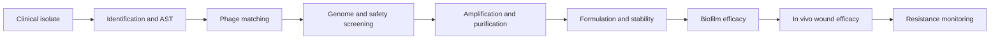

# Personalized Phage Pipeline

```mermaid
flowchart LR
  A[Clinical isolate] --> B[Identification and AST]
  B --> C[Phage matching]
  C --> D[Genome and safety screening]
  D --> E[Amplification and purification]
  E --> F[Formulation and stability]
  F --> G[Biofilm efficacy]
  G --> H[In vivo wound efficacy]
  H --> I[Resistance monitoring]
```
